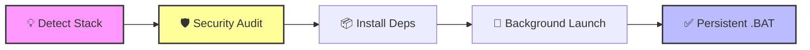

# Universal Project Launcher (Windows Only)

[繁體中文版說明](./README_zh-TW.md)

This repository contains a specialized skill for **Gemini CLI** that provides an automated, security-focused workflow for setting up and launching software projects across multiple technical stacks.

> **Note:** This tool is specifically designed for **Windows** environments and utilizes `.bat` scripts for persistent launchers.

## System Requirements
- **OS**: Windows 10 or 11 (64-bit)
- **Environment**: CMD or PowerShell
- **Tools**: Python 3.x, Node.js, or Java installed in PATH.

## 📦 Core Workflow



----------------------------------------

## Features
- **Intelligent Tech Stack Detection**: Automatically recognizes Python, Node.js, and Java projects.
- **Environment & Dependency Management**: Handles `venv`, `npm install`, and Java build tool configurations.
- **Mandatory Security Audit**: Performs OSV vulnerability scans and deep behavioral code analysis (`os.system`, `eval`, hardcoded secrets) before any launch.
- **Dual Launch Strategy**: Launches applications in the background for immediate use and generates a persistent `.bat` launcher for future sessions.

## Installation

Install directly from GitHub:

```bash
gemini skills install https://github.com/Yunotang/universal-project-launcher.git
```

Or install locally:

```bash
gemini skills install . --scope user --consent
```

## Automated Workflow (No More Manual Setup)

This Skill automates the tedious manual steps usually performed in a separate terminal:

1. **Virtual Environment Setup**: Automatically detects and creates `.venv` or `node_modules`.
2. **Environment Activation**: Automatically links the environment for dependency isolation.
3. **Dependency Installation & Security Scanning**: Executes `pip install` or `npm install`.
   - 🛡️ **Vulnerability Check**: Cross-references the OSV database to block known vulnerable packages.
4. **Launch, Verification & Persistent Launcher**:
   - 🛡️ **Deep Code Audit**: Performs behavioral auditing (API Keys, system calls) before launch.
   - **One-Click Startup**: Automatically generates a `launch_[project].bat` file for future instant access.

## How to use
Once installed, reload your skills:
`/skills reload`

Then simply ask Gemini CLI:
- "Setup the environment and launch my project."
- "Scan this folder and start the server."
- "Verify the security and run the app."

## Security First
This skill prioritizes safety. It will **not** launch any application until a manual security confirmation is provided after the automated behavioral audit.
